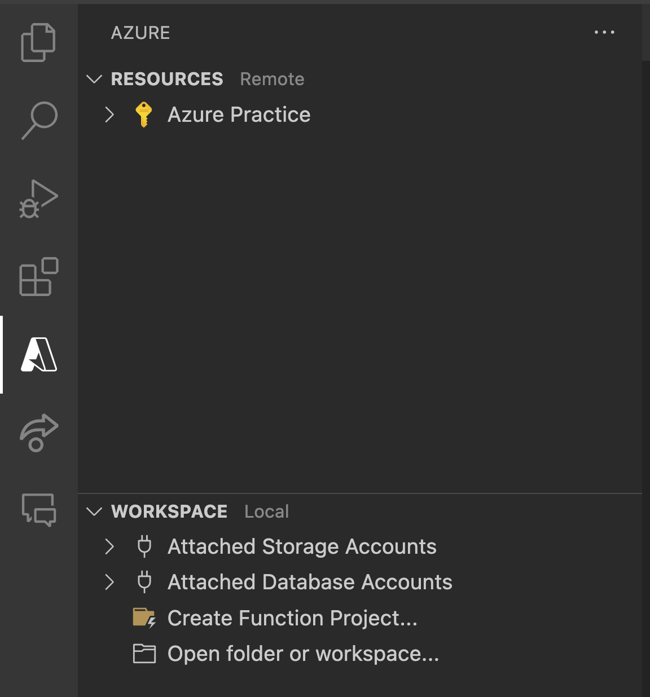
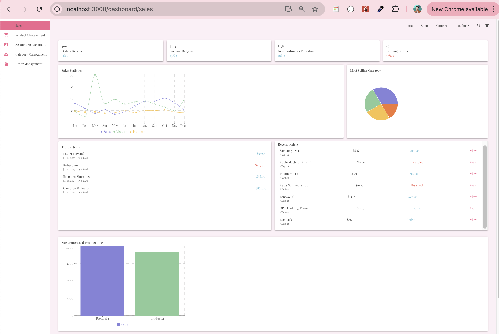

# Deployment and Project Enhancement

## Project Enhancement

### Configure Swagger

By default, Swagger page does not contain authentication section in the header, causing the tests of authenticated routes to be troublesome. To resolve this, you can add the following codes to your project, outermost layer

```csharp
dotnet add package Swashbuckle.AspNetCore.Filters
builder.Services.AddSwaggerGen(options =>
{
    options.AddSecurityDefinition("Bearer", new OpenApiSecurityScheme
    {
        Description = "Bearer token authentication",
        Name = "Authentication",
        In = ParameterLocation.Header
    });
    options.OperationFilter<SecurityRequirementsOperationFilter>();
});
```

Also, you can reconfig swagger route to be default page if needed

```csharp
app.UseSwaggerUI(options =>
{
    options.SwaggerEndpoint("/swagger/v1/swagger.json", "v1");
    options.RoutePrefix = string.Empty;
});
```

If you go to swagger page now, you no longer need to get to endpoint `/swagger`, but the default port page would be the swagger page. Also, you would find a clickable section called `Authorize` to save your bearer jwt token (same like in Postman). Also, you might find in the document, lock symbols have been added to routes requiring authentication. This is a nice way to decument your endpoints.


### Data seeding

Your database should contain rich dataset for the frontend UI. You can create a class, for example `SeedingData.cs` in the same folder as your database context file. This class will be in charge of generating dummy dataset. There are 2 options to generate dataset:

1. Using C# code (I prefer ChatGPT to help generating hundreds of records in each collection, so I have rich frontend). While ChatGPT cannot generate a whole file at one,I request dummy data for each collection and copy paste. You can find my sample result from ChatGPT here [SampleData.cs](documents/SampleData.cs). This approach is quite straightforward, but would burden the codebase. You might need to comment it out after migrations, so in deployment, it would not run.
2. Using `.csv` file [SampleCsv.cs](documents/SampleCsv.cs).

```csharp
protected override void OnModelCreating(ModelBuilder modelBuilder)
{
    // ... other codes here
    /* Seeding the database - comment out after migrations*/
    // modelBuilder.Entity<User>().HasData(SeedingData.GetUsers());
    // modelBuilder.Entity<ProductColor>().HasData(SeedingData.GetProductColors());
    // modelBuilder.Entity<ProductSize>().HasData(SeedingData.GetProductSizes());
    // modelBuilder.Entity<Category>().HasData(SeedingData.GetCategories());
    // modelBuilder.Entity<ProductLine>().HasData(SeedingData.GetProductLines());
    // modelBuilder.Entity<Image>().HasData(SeedingData.GetImages());
    // modelBuilder.Entity<Product>().HasData(SeedingData.GetProducts());
    // modelBuilder.Entity<User>().HasData(SeedingData.GetUsers());;
}
```

### Enhance EF Core

- Use `AsNoTracking()` for the `Select` operations, iliminating the needs to change tracker in EF Core. Example

```csharp
public override async Task<ProductLine?> GetByIdAsync(Guid id)
{
    return await _databaseContext.ProductLines.AsNoTracking()
        .Include(p => p.Images)
        .Include(p => p.Category)
        .Include(p => p.Products).ThenInclude(p => p.Size)
        .Include(p => p.Products).ThenInclude(p => p.Color)
        .FirstOrDefaultAsync(p => p.Id == id);
}
```

- Always sort and paginate the collection, even if not specifically requested by client. For this, you can always set default value of We should make sure returned data is in the same order when called multiple times

```csharp
public override async Task<IEnumerable<Product>> GetAllAsync(GetAllOptions getAllOptions)
{
    return await
    _data.AsNoTracking()
    .Include(p=>p.Color)
    .Include(p=>p.Size)
    .OrderBy(p => p.UpdatedAt)
    .Skip(getAllOptions.Offset)
    .Take(getAllOptions.Limit)
    .ToArrayAsync();
}
```

- [***very optional, bonus point***] If you want to have a way to perform dynamic filtering/searching in all the entities, I would highly recommend to have a same property called `List<string> Tags` in in all entities. When we create the entity from dto, we can decide how tags of each entity is extracted. For example, for `User`, `Tags` can be collection containing firstname, lastname, email. For `Product`, tags can be the keywords set by admin, or taken from titles, etc....

```csharp
public virtual async Task<IEnumerable<T>> GetAllAsync(GetAllOptions getAllOptions)
{
    var query = _data.AsNoTracking();
    if (!string.IsNullOrEmpty(getAllOptions.SearchKeyword))
    {
        var keywords = getAllOptions.SearchKeyword
                                    .Split(' ', StringSplitOptions.RemoveEmptyEntries)
                                    .Select(k => k.ToLower())
                                    .ToArray();

        query = query.Where(p => p.Tags.Any(tag => keywords.Contains(tag.ToLower())));
    }

    if (!string.IsNullOrEmpty(getAllOptions.OrderBy))
    {
        var orderBy = getAllOptions.OrderBy + (getAllOptions.IsDescending ? " descending" : " ascending");
        query = query.OrderBy(orderBy);
    }
    else
    {
        query = query.OrderBy("UpdatedAt");
    }

    query = query.Skip(getAllOptions.Offset)
                    .Take(getAllOptions.Limit);

    return await query.ToListAsync();
}
```

### Deployment

1. Database server

- Open an account in [neon.tech](https://neon.tech/)
- Create PostgreSQL database, update the connection string in your app setting and perform migrations.

2. Web host for .NET project

- Open an account [Azure](https://azure.microsoft.com/en-us/pricing/purchase-options/azure-account). Use `Try Azure for free` (or `Pay as you go` if this option is not available to use. We would use free services only, so the plan would not cost anything)
- In your VSCode, install `Azure Tools` extension, and log in via the Azure tab in your VSCode 
- In VS Code, go to command palette, then type Azure: Sign In and press Enter. This will prompt you to sign in to your Azure account via a web browser. Follow the instructions to complete the sign-in process.
- Start creating all necessary components in this following order:
  - Azure subscription, name it any thing you like, such as `Azure Practice`(not necessary if you have 1 default subscription, you can use it)
  - Expand your subscription, choose `App Service`, right click and choose `Create New Web App Advanced`. The prompt in VSCode would ask you to create following elements before you can actually create your web app hosting:
    - Resource group: Give it an unique name, choose the closest region (may be North Europe)
    - App service plan: use run time as .NET 8, use linux for lighter size, free tier
  - Now, you can go and start configuring your App Service to host your application
- Go to the outermost layer and compile your codes under Realease mode for publishing: `dotnet publish -c Release -o publish`. Now, you should see all compiled codes in the `publish` folder. Right click on `publish` folder, you would see option `Deploy To Web App`
- Once the deployment is successful without error, you can start browsing the backend api remotely. Go back to Azure extension, App Services, right click on the service you've deployed to and `Browse`.
- Each service would have log stream (alternatives to console in development). You might find option to open the log stream when right click the service as well.

### Additional features for frontend use
- If you have more time and wish to build more powerful admin dashboard or better looking landing page, have more analysis endpoints in backend would be great. For example [SalesController](documents/SalesController.cs). Here is quick dashboard, still working-on-progress 
